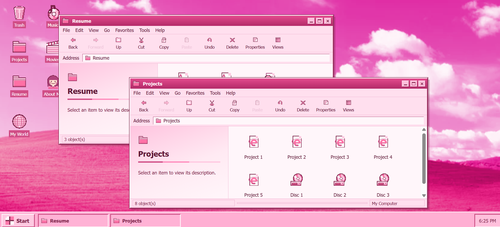

# Jordan Duncan — Personal Portfolio

A personal portfolio site styled as a nostalgic Windows 98-style desktop — draggable icons, retro pop-up windows, a working "Resume" document viewer, and a "Projects" folder full of shortcuts, all wrapped in a pink, sparkly theme.

**Live site:** https://jordan-duncan-portfolio.vercel.app/



## About

This site is designed to feel like booting up a personal desktop rather than scrolling a typical portfolio page. Icons on the desktop (About Me, Projects, Resume, My World, Music, Movies) open into draggable, resizable "windows" complete with title bars, a fake Word document viewer for work/academic experience, and a printable/downloadable resume.

It was designed and built with **Claude Design** — Claude's AI-assisted design workflow was used to generate and iterate on the visual design (layout, retro UI chrome, color/type/spacing tokens, and animations), then refined screen by screen.


## Features

- My projects explained in more detail than my resume and github
- A downloadable and printable resume (`Jordan_Duncan_Resume.docx`)
- Custom retro cursor, scrollbars, dialog boxes, and taskbar/start menu chrome
- Fully responsive single-page layout, no build step required

## Tech Stack

- HTML, CSS, and JavaScript
- [Google Fonts](https://fonts.google.com/) — Comic Neue, Silkscreen, Pixelify Sans
- Built and designed using **Claude Design**

## Running Locally

This is a static site with no build step or dependencies. Clone it and open `index.html` in a browser, or serve it locally:

```bash
git clone https://github.com/jordan-can-dunk/<repo-name>.git
cd <repo-name>
npx serve .
```

## File Structure

```
.
├── index.html              # Main desktop app markup and logic
├── support.js               # Claude Design canvas runtime
├── image-slot.js             # Image/icon rendering helper
├── Jordan_Duncan_Resume.docx # Downloadable resume
└── *.png                    # Screenshots used in the Projects section
```

## Contact

- Email: [jordan4duncan@gmail.com](mailto:jordan4duncan@gmail.com)
- LinkedIn: [linkedin.com/in/jordanmduncan](https://www.linkedin.com/in/jordanmduncan/)
- GitHub: [github.com/jordan-can-dunk](https://github.com/jordan-can-dunk)
